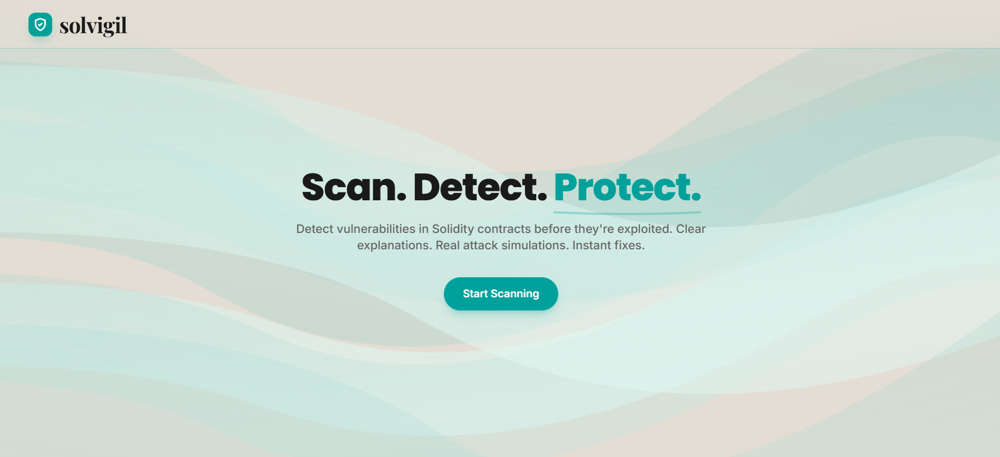
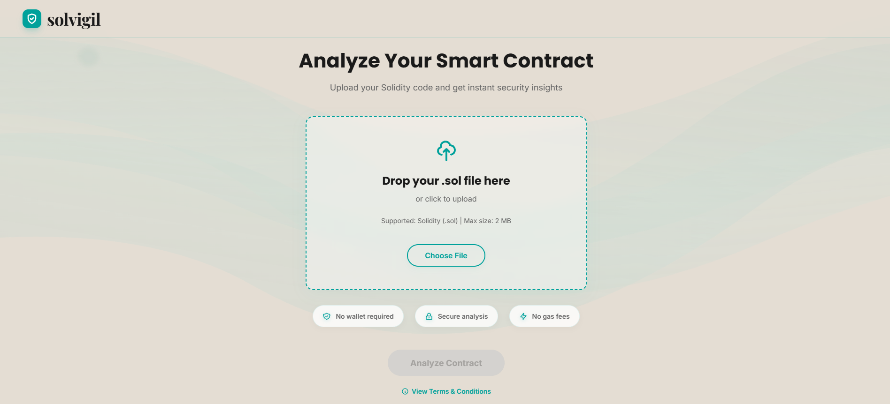
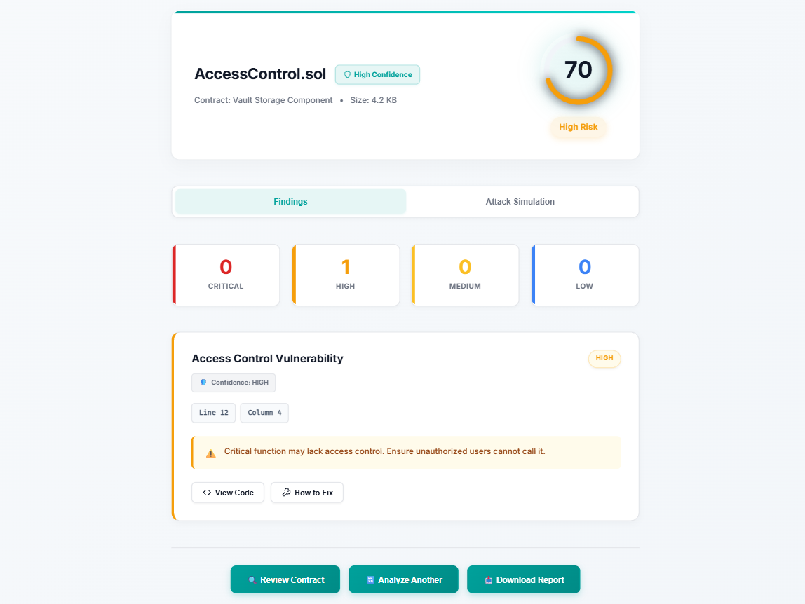
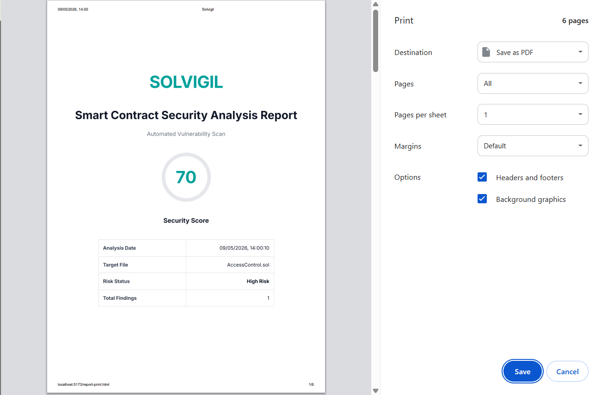

<div align="center">
  

  # Solvigil

  **Static Analysis & Security Scanning Platform for Solidity Smart Contracts**

  [](https://opensource.org/licenses/MIT)
  [](https://soliditylang.org/)
  [](https://nodejs.org/)
  [](https://tailwindcss.com/)
</div>

<br />

## 🎥 Demo Video

[▶ Watch Full Demo on YouTube](https://youtu.be/X0S605g34yM)

## 📖 Project Overview

Solvigil is a specialized static analysis tool designed to identify vulnerabilities in Solidity smart contracts. Built with a fast Node.js backend and a modern web interface, it analyzes smart contract code to detect critical security flaws, providing developers and auditors with immediate, actionable feedback to secure decentralized applications before deployment.

## 🛑 Problem Statement

Smart contract vulnerabilities often lead to catastrophic financial losses. Due to the immutable nature of blockchains, post-deployment bug fixes are extremely difficult or impossible. Existing security tools are either excessively complex, command-line only, or prohibitively expensive for individual developers. Solvigil bridges this gap by offering a fast, highly visual, and accessible static analysis platform that integrates easily into developer workflows.

## ✨ Features

- **AST-Based Static Analysis**: Parses Solidity code into Abstract Syntax Trees for highly accurate vulnerability detection.
- **Interactive Dashboard**: Modern, responsive interface providing clear visualizations of vulnerability distributions.
- **Detailed Vulnerability Reports**: Highlights affected code lines with clear explanations and step-by-step remediation strategies.
- **Exportable Audit Reports**: Generates professional, offline-ready PDF reports summarizing findings for stakeholders.
- **Fast Execution**: Lightweight architecture ensures near-instantaneous feedback for smart contract scans.

## 🏛️ Architecture Overview

The system operates across three primary layers:
1. **Frontend (Client)**: A lightweight, responsive UI built with vanilla JavaScript, HTML5, and Tailwind CSS. It handles file uploads, state management via `sessionStorage`, and visualizes the audit payload.
2. **Backend (API)**: A Node.js service that accepts `.sol` files, handles temporary file storage, and feeds the source code into the analyzer.
3. **Core Engine**: Uses a Solidity parser to generate an Abstract Syntax Tree (AST). The AST is then passed through a custom rule-matching engine containing definitions for common attack vectors.

## 🛡️ Supported Vulnerability Detectors

Solvigil currently targets the most critical smart contract vulnerability patterns:

| Vulnerability Type | Severity | Description |
| ------------------ | :------: | ----------- |
| **Reentrancy** | High | Detects state changes occurring after external calls (CEI pattern violations). |
| **Access Control** | High | Identifies unprotected critical functions lacking `onlyOwner` or similar modifiers. |
| **Integer Overflow/Underflow** | Medium | Flags arithmetic operations lacking safe math structures (crucial for `< 0.8.0`). |
| **Unchecked External Calls** | Medium | Detects low-level `call()` usage where the return boolean is ignored. |
| **Denial of Service (DoS)** | Medium | Identifies unbounded loops or gas-heavy operations that could halt contract execution. |
| **Solidity Version Risks** | Low | Flags outdated pragma directives with known compiler bugs. |

## 📸 Screenshots

> *Note: Replace placeholder paths with actual image URLs once hosted.*

| Landing Page | Scan Interface |
| :---: | :---: |
|  |  |

| Analysis Dashboard | PDF Report Output |
| :---: | :---: |
|  |  |

## 🛠️ Tech Stack

**Frontend:**
- HTML5, Vanilla JS
- Tailwind CSS & PostCSS
- Vite (Build Tooling)
- HTML2PDF.js (Report Generation)

**Backend:**
- Node.js
- Express.js (REST API)
- Solidity Parser (AST Generation)

## 🚀 Installation

Ensure you have [Node.js](https://nodejs.org/) (v16+) installed.

1. **Clone the repository:**
   ```bash
   git clone https://github.com/0xAnandDev/Solvigil.git
   cd Solvigil
   ```

2. **Install Frontend Dependencies:**
   ```bash
   npm install
   ```

3. **Install Backend Dependencies:**
   ```bash
   cd backend
   npm install
   cd ..
   ```

4. **Environment Setup:**
   Create a `.env` file in the `backend` directory if specific configurations are required (e.g., ports).

## 💻 Usage

To run the application locally, you need to start both the frontend development server and the backend API.

**1. Start the Backend API:**
```bash
cd backend
npm start
```
*The API will start on `http://localhost:3000` (or designated port).*

**2. Start the Frontend Application:**
Open a new terminal window:
```bash
npm run dev
```
*Vite will launch the local development server, typically at `http://localhost:5173`.*

## 🔍 Example Analysis Workflow

1. Open the Solvigil frontend in your browser.
2. Click **Start Scanning** and upload a `.sol` smart contract file.
3. The file is sent to the backend, parsed into an AST, and run against the vulnerability ruleset.
4. The backend returns a JSON payload containing a severity breakdown, total score, and specific line-by-line findings.
5. The frontend redirects to the **Analysis Results** dashboard to visually explore the flaws.

## 📊 Security Scoring Explanation

Solvigil utilizes a weighted scoring system to determine the overall health of a smart contract. The baseline score starts at `100/100` and deductions are applied based on the severity of identified issues:
- **Critical Issues:** Heavy penalty (immediate failure state).
- **High Issues:** Major deduction.
- **Medium Issues:** Moderate deduction.
- **Low Issues/Warnings:** Minor deduction.

Scores below `70` indicate significant security risks requiring immediate remediation before deployment.

## 📄 PDF Report Generation

Solvigil includes a built-in module for exporting findings as professional PDF documents. This operates entirely client-side using `html2pdf.js`. 
- **Isolated Rendering Pipeline:** The report architecture separates the visible UI from the PDF layout, ensuring elements like viewport units and flexbox don't break the A4 layout constraints.
- **Contents:** Includes an executive summary, security score, severity breakdown chart, and line-by-line vulnerability explanations.

## 🛣️ Future Roadmap

- [ ] Implementation of advanced symbolic execution analysis.
- [ ] Integration of CI/CD pipelines via CLI tool.
- [ ] Support for multiple contract uploads and project-level context analysis.
- [ ] Integration with Slither and Mythril engines as fallback parsers.

## ⚠️ Disclaimer

Solvigil is an automated static analysis tool and should be used as a supplementary layer of defense. It does not replace a professional, manual security audit conducted by experienced smart contract security engineers. Do not deploy code holding significant financial value based solely on automated scan results.

## 🤝 Contributing

Contributions are welcome! Please follow these steps:
1. Fork the project.
2. Create your feature branch (`git checkout -b feature/AmazingFeature`).
3. Commit your changes (`git commit -m 'Add some AmazingFeature'`).
4. Push to the branch (`git push origin feature/AmazingFeature`).
5. Open a Pull Request.

## 📜 License

Distributed under the MIT License. See `LICENSE` for more information.

## 📬 Author / Contact

**Anand**  
- GitHub: [@0xAnandDev](https://github.com/0xAnandDev)
- Project Link: [https://github.com/0xAnandDev/Solvigil](https://github.com/0xAnandDev/Solvigil)
